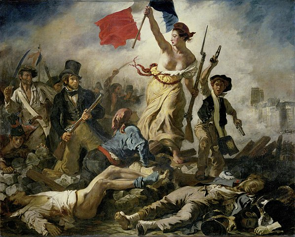

# 19th Century French Politics

## 1789 - 1792 Revolution and End of Monarchy 

- The French government is nearly bankrupt because of war debts; and bad harvests have led to famine.
- Louis XVI agrees to set up the Estates General, a medieval institution supposed to advise the King, consisting of representatives of the clergy (first estate), the nobility (second estate), and the people (third estate).
- Each tax district votes for third-estate representatives, the electorate being male property owners and registered tax payers.  
- Last called in 1649, over a hundred years before, on this occasion the Estates General is intended as a device to bypass the more normal tax-raising processes, which had become deadlocked.
- The third estate takes over and forms the National Assembly, joined by some from the nobility and clergy.
- The Assembly defines a new constitution and invites the King to agree to it, which he reluctantly does.
- The Assembly goes through several reorganisations and name changes, but the King is still treated as the ultimate authority.  He resists many of the Assembly's proposals.
- The renamed 'Legislative Assembly' is composed of 745 men. Those who sit on the right support monarchical power, those on the left are the more radical.
- Austria and Germany, both monarchies, are worried by events in France, and also see opportunities because of her perceived weakness. They mass troops at the borders and demand the French monarchy be protected. The French declare war, Austria and Prussia invade, but the French beat them back at Valmy.
- Louis is suspected of working with Austria and Prussia. He is arrested and the Assembly dissolved to be replaced by an elected 'National Convention'

## 1792 - 1795  National Convention 

- A body of 786 elected through universal male suffrage.  Many of its members have served in the preceding Assemblies.
- The King has no formal power.
- In Jan 1793 by a narrow margin the Convention votes for the execution of the King, who is duly guillotined.
- In 1793, a series of victories by the 'new French armies' is followed by a series of defeats.  
- 1793 there are uprisings against the revolution, the most serious is in the Vendée in south-west France, leading to a counter-revolutionary war which last three years. 
- The Convention delegates power to the 'Committee for Public Safety' run by Robespierre.
- Napolean at that time a senior gunner, is involved in the Siege of Toulon, and begins his rise in the revolutionary French army. By the end of 1793, at 24, he is a brigadier general.
- 'The Reign of Terror' begins in the summer of 1793, and thousands executed, including those from the nobility,  but also many revolutionaries too. 

## 1795 - 1799 Directory

- Robespierre is removed from the Committee for Public Safety, and executed in July 1794. 
- The National Convention adopts a new constitution which is approved by plebiscite. 
  - Voting is restricted by a stringent property qualification.
  - The Directory is a group of five who jointly have executive power. Laws are drafted by the 'Council of 500', and reviewed by an upper house of 250 men.  
- Throughout its existence the Directory has to deal with an economy in permanent crisis, and with constant war against foreign coalitions. 
- The wars, in general, don't go well, but Napoleon successfully conquers a large part of Italy and then moves on to Egypt.
- In 1799 he returns from Egypt and carries out a coup d'etat.

## 1799 - 1804 Consulate

- Napoleon sets-up a dictatorship with himself as the the 'first consul', this is endorsed by a public referendum.
- Economically, France improves.   

##  1804 - 1815 First French Empire  

- In 1804 Napoleon  becomes Emperor of the French. 
- France becomes the dominant power in Europe, with defeats for Austria, Prussia, Russia, and Britain during the Napoleonic Wars. By 1812 most of Western Europe is either directly administered by France, a client state, or under military occupation.
- In 1812 in response to the emperor of Russia's leadership of an insurrection against France, Napoleon invades Russia. 
- Despite reaching Moscow he is defeated by the scale of the country and the climate, and retreats in the winter. 
- Losses follow, France surrenders, and Napoleon abdicates in April 1814. 
- Less than a year later in March 1815 he escapes from exile and retakes power; but only for a hundred days.
- He is defeated by the British and Prussians at Waterloo. 

## 1814 - 1830 Bourbon Restoration 

- The victorious powers restore the monarchy in 1814, it is interrupted by Napoleon's hundred days, but re-restored in 1815.
- The king is Louis XVIII, brother of the executed Louis XVI.
- Then Charles X. Another brother. 
- Most legal and institutional reforms are maintained.  
- This is a constitutional monarchy, not absolutist. 
- Franchise for men paying a certain high tax rate.
- Louis quite liberal, Charles more conservative.
- Charles sparks another revolution when he tries to manipulate the general election

## 1830 -  1848 July Monarchy: Kingdom of France 

- Louis-Philippe, Duke of Orleans is given the throne by the bourgeois-controlled Chamber of Deputies 
- He rules as 'King of the French', known as 'The Citizen King'.
- As a young man had fought on the revolutionary side, but broke with them over their decision to execute Louis XVI.
- He promises to follow a 'middle road'.
- Voting is restricted to men paying a high level of taxes, and is thereby restricted to about one percent of the population.
- The government is dominated by the 'high bourgeoisie' of bankers, financiers, industrialists, and merchants. 
- There is a lot political dissent, riots, and attempted insurgencies; eventually another revolution.

## 1848 - 1852 Second French Republic 

- A democratic republic - no king.
- All men had the vote: universal male suffrage. 
- Louis Napoleon, nephew of the original Napoleon, is elected President.
- According to the constitution he is supposed to step down after four years, but doesn't. 

## 1852 - 1871 Second French Empire 

- Louis Napoleon changes the constitution to be able to server longer as president, but then proclaims himself Emperor Napoleon III. 
- This is a coup d'etat which results in a Napoleon becoming emperor, and so is reminiscent of his uncle's ascendency to power, hence the quote (misquote actually): 'history always repeats itself, the first time as tragedy the second time as farce' 
- A bit unfair, Napoleon III is an energetic and successful reformer.
- Responsible for enormous amounts of modernisation, industrialisation, and city reconstruction, especially in Paris. 
- For example, he is responsible for building the Gard du Nord station.
- Working with Haussmann, he clears a lot of medieval Paris, constructing wide new avenues.
- Becomes ill in the late 1860s.
- Loses a war with Prussia, and loses territory.
- Napoleon III is captured and held prisoner by the Prussians. He dies a few years later in Chiselhurst, England, and is buried in Farnborough.

## 1871 - 1940 Third Republic 

- France loses the Franco-Prussian war, Paris is captured, and the settlement with Prussia means France forfeits its eastern regions.
- The Germans leave Paris.
- Revolution in Paris, 1870-1871, leads to the radical Paris Commune. It is suppressed by the French army who kill thousands of people (up to 20,000).
- The post-war constitution is intended to be temporary, and there are some who want the monarchy to be restored. 
- But republicanism is increasingly popular, and it's not clear among the monarchists who should be king. Republicanism dominates. 

 

