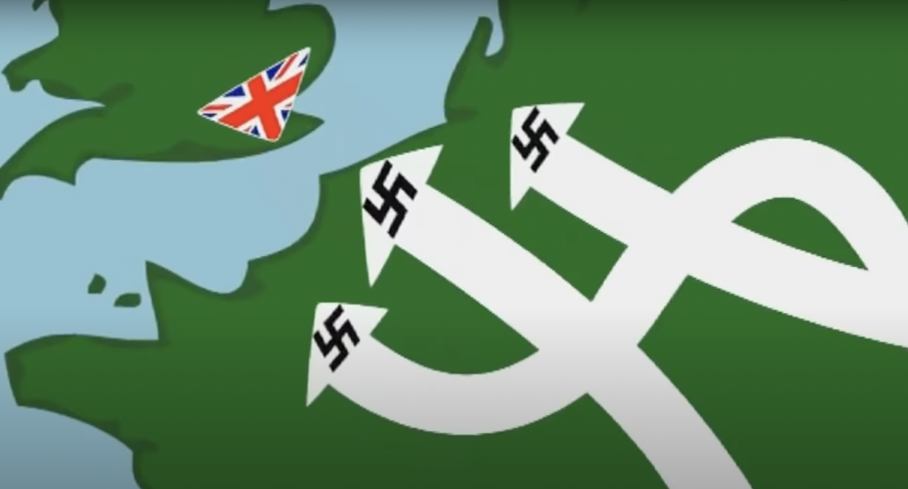

# World War II Timeline

## 1933 

- Jan 30th. Adolf Hitler becomes Chancellor of Germany

## 1939

- Sept 1st. Germany invades Poland.  
- Sept 3rd. Poland’s allies Britain and France declare war on Germany.
- Sept 17th. Soviet Union invades Poland; Poland surrenders 19 days later.

## 1940

- April 8th. Germany invades Norway
- May 10th. Churchill becomes UK Prime Minister.
- May 10th. Start of German invasion of France (Ends 25th 1940, with surrender of France).
- May 26th. Start of Dunkirk evacuation. (Ends June 4th 1940.)
- June 4th. End of Dunkirk evacuation. (Started June 4th 1940.)
- June 14th. Paris falls.
- June 25th. France surrenders to Germans (Invasion started June 4th 1940.)
- July 10th. Luftwaffe begins attacks on channel shipping: starting the first phase of the Battle of Britain. (Ends on Oct 31st 1940.)
- Oct 31st. End of Battle of Britain.(Started on July 10th 1940.)
- Sept 7th. Black Sunday, massive bombing of London, the start of the Blitz. (Ends May 11th 1941.)
- Dec 9th. Start of Operation Compass, British and Empire troops defeat the Italians in Libya and Egypt. (Ends Feb 9th 1941.)

## 1941

- Feb 9th. End of Operation Compass. (Started Dec 9th 1940.)
- May 11th. End of the Blitz. (Started June 4th 1940.) Over 40,000 have been killed. 
- June 22nd. Launch of Operation Barbarossa. 
- Dec 7th. Japan attacks Pearl Harbour.

## 1942

- Jan 20th. Wannsee Conference. Approval of the Plan for the Final Solution to the Jewish Problem.
- Feb 15th Fall of Singapore.
- June 4th. Start of the Battle of Midway. (Ends June 7th 1942)
- June 7th. End of the Battle of Midway. (Started June 4th 1940)
- Oct 23rd. Battle of El Alamein

## 1943

- 31st Jan Paulus surrenders at Stalingrad

## 1944

- 6th June D-Day, Operation Overlord.